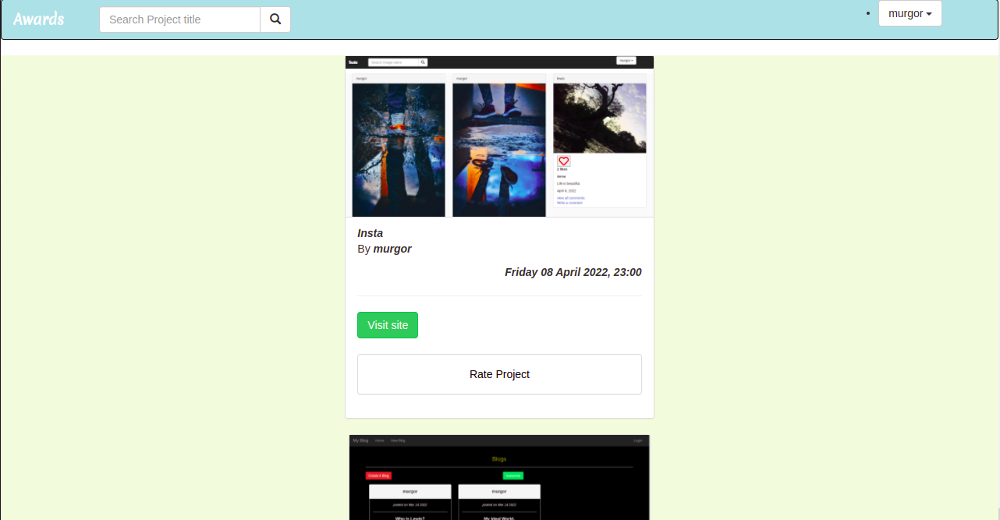

# Awards

#### A website that allows a user to post his/her projects to be reviewed and rated by other users.

#### By **Lewis Murgor**

## Below is a part of the project.

A user is required to sign up and login to view the above page. The page shows the projects posted by different users. A user can visit the site using the button 'visit site' and also see the project's details and rate the project using the rate project.A user can post a project, visit his/her profile page, change his/her password and logout using the dropdown button in the navbar.

## Description
This is a projects awards website. It requires a user to login to the website to start using the website. A user can view different projects and the project details that have been posted by other users. He/she can rate the projects' design, usability and content on a scale of 1 to 10. A user can also post his/her projects for other users to view and also rate them. A user can search for any project using the project's title.

## Setup/Installation Requirements
* You can clone this repository by running 'git clone https://github.com/lewis-murgor/site-awards.git' in your terminal.
* Create a virtual environment.
* Install pip
* Run 'pip install -r requirements.txt' to install all the dependencies.

## Known Bugs
The application has no known bugs.

## Live Site
The live link of the project is  https://awards-29.herokuapp.com/

## Technologies Used
* Python
* Django
* HTML
* Css

## Support and contact details
You can contact me through the email kiplagatlewis29@gmail.com
### License
You can check the licence [here](https://github.com/lewis-murgor/site-awards/blob/master/Licence)
##
Copyright (c) 2022 
##
**Lewis Murgor**